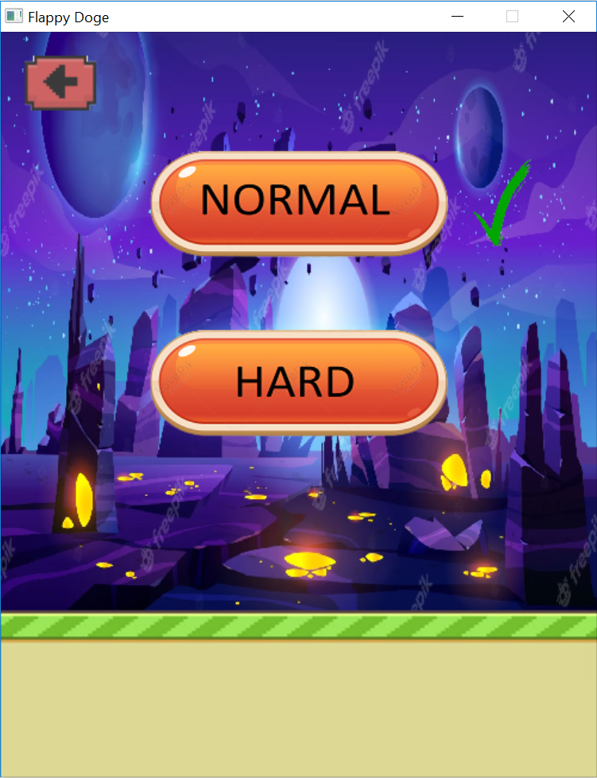

# Chào mừng bạn đến với dự án lớn đầu tiên của tôi <3 <3 <3 (Flappy Doge)
## Tổng quan về game Flappy Doge:
- Đây là game mà tôi dựa trên Flappy Bird rất nổi tiếng của Nguyễn Hà Đông.
- Tôi có dựa theo các youtuber có làm về game này, `lazyfoo` và lấy các nguồn ảnh, âm thanh, nhạc trên google cũng như các youtuber. Tôi xin chân thành cảm ơn, và tôi cũng đã cố gắng hết sức để phát triển game Flappy Doge trở nên tốt hơn, có sức cuốn hút hơn.
- Tôi có sử dụng `SDL2` gồm các thư viện `SDL2`, `SDL2_image`, `SDL2_mixer`, `SDL_ttf`. Tôi đã để trong file SDL2 để tiện cho các bạn tải về và sử dụng nhé.
- Game của tôi chạy trên Windows, tôi cũng đã cố gắng tìm hiểu để nó có thể chạy trên các hệ điều hành khác nhưng vì thời gian có hạn nên các bạn đọc hãy thông cảm và điều chỉnh một chút để chạy game nhé.
## Đi vào chi tiết của game nhé:
---
### Màn hình chính của game:
- Bạn sẽ thấy chú chó của chúng ta (tôi gọi chú là `shiba` nhé) bạn sẽ thấy khung cảnh đằng sau chú cũng như một số `button` gồm: nút `quit` để bạn thoát khỏi game, nút `level` để bạn có thể chọn level muốn chơi, nút `help` là một số hướng dẫn ngắn để bạn có thể hiểu qua về game, nút `hình âm thanh` phía bên phải trên cùng để bạn có thể chọn nhạc nền bạn muốn nghe nhé. Một số hình ảnh minh họa nhé: 
  
### Chi tiết hơn về game:
#### Level: có 2 mức level trong game:
- level normal : sẽ khá giống với flappy bird khi sẽ có các cột được sắp xếp ngẫu nhiên và bạn mỗi khi bạn qua một cặp cột (cột trên và dưới) bạn sẽ dành được 1 điểm. Khi va chạm với (đất, trời, cột) thì shiba để chết. 
- level hard: sẽ có thêm 1 số kẻ thù để làm game khó hơn, dơi bắn hỏa tiễn, nếu shiba ở vùng nổ của hỏa tiễn thì cũng sẽ bị chết. Ngoài ra các cột cũng sẽ di chuyển lên xuống để tăng độ khó cho game, và shiba thì sẽ di chuyển ngược với level normal (tôi sẽ nói tạm là ấn nút nhé, cụ thể là nút gì thì sẽ được tôi mô tả ở đoạn sau) khi bạn ấn nút thì shiba sẽ bay xuống và trọng lực sẽ kéo bạn lên trên. Khá là hay ho nhỉ. À ngoài ra khi bạn trong một khoảng điểm thì có tia laser ở phía dưới, đừng chạm vào nó nhé, shiba sẽ mất mạng đấy.
- Một số ảnh minh họa cho 2 chế độ:
1. Chế độ normal : 
2. Chế độ hard :  
#### Có 2 background chính trong lúc chơi:
- Background ban ngày, như dưới đây:

- Background ban đêm, như dưới đây: 

#### Cách chơi của game: 
- Bạn nhấn nút `space(nút cách)` hoặc `click chuột ` hoặc `mũi tên lên` để shiba bay lên cao.
- Bạn có thể tạm dừng trò chơi bằng nút `esc` hoặc click vào ô dừng ở phía trên cùng bên phải của trò chơi.
#### Về menu lúc ta tạm dừng trò chơi: 

- Trước tiên bạn sẽ mục `score` là điểm số hiện tại bạn dành được, mục `best` là điểm cao nhất bạn đạt được (tùy `level` bạn chọn thì sẽ có mục `best` khác nhau nhé)
- Bạn có bật/tắt âm thanh bằng cách click vào biểu tượng âm thanh: 
- Bạn có thể thay đổi màu của chó chú shiba ở đây: 
#### Về menu lúc shiba chết:

-Ngoài `score` và `best` ra thì có mục huy chương `medal`.
- `medal` sẽ có 3 huy chương chính:
1. Khi bạn có số điểm <=20 thì sẽ nhận huy chương danh dự: 
2. Khi bạn có số điểm (>20 và <=50) thì sẽ nhận huy chương bạc : 
3. Khi bạn có số điểm > 50 thì sẽ nhận huy chương vàng : 
---
## Lời kết:
Cảm ơn các bạn đã đọc đến đây, vì đây là dự án đầu tiên của mình nên còn nhiều sai sót, mong các bạn đọc bỏ qua cho mình. Mình cũng mong rằng các bạn nếu có thời gian và đam mê hãy tải game về và tiếp tục phát triển tựa game này. Mong rằng các bạn có thể dành cho mình 1 sao để làm mình có thêm động lực cho những sản phẩm trong tương lai. Một lần nữa cảm ơn bạn đọc rất nhiều <3 <3 <3 

